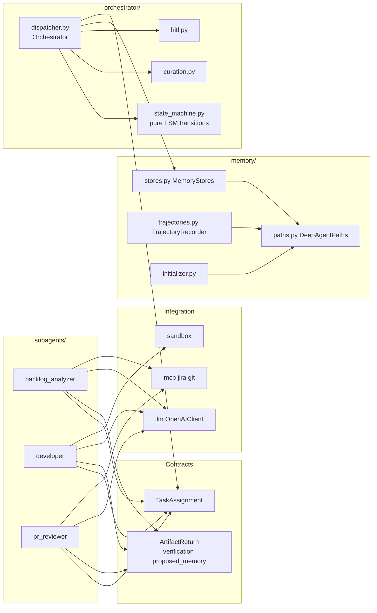
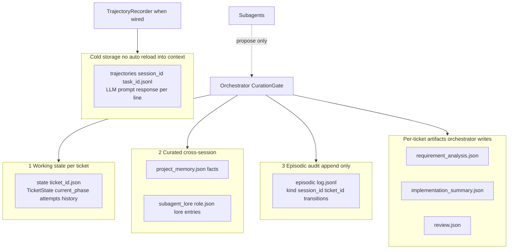
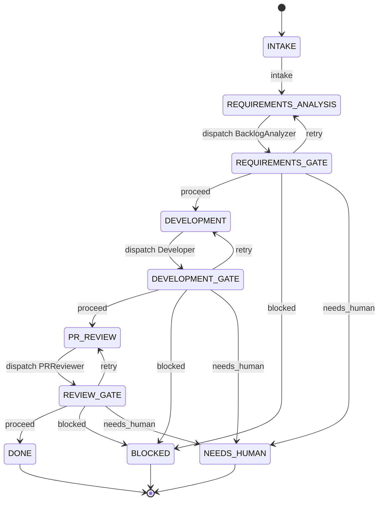
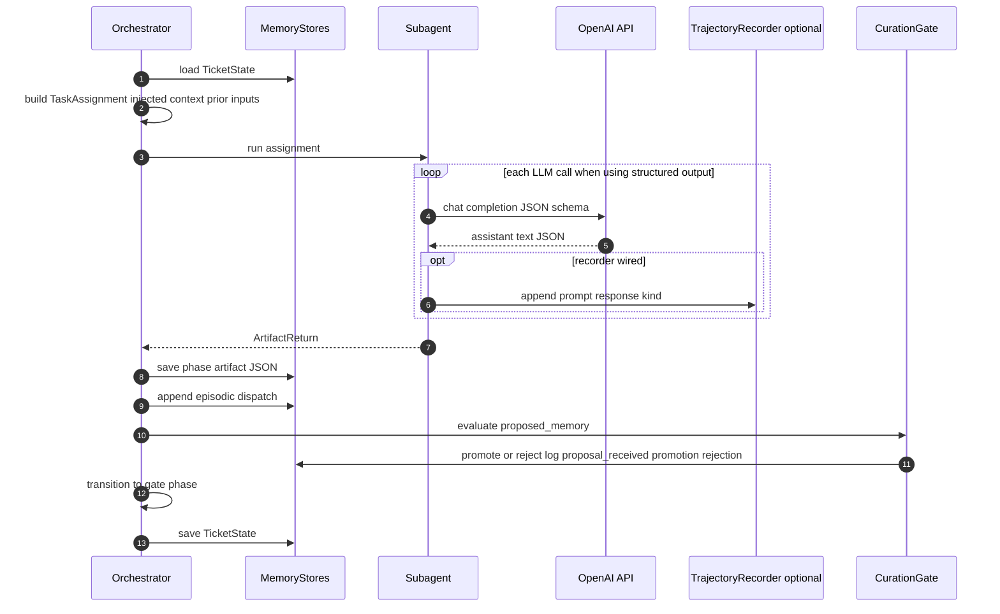
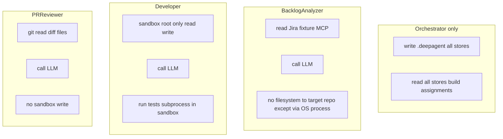

# System-level design diagrams

This document is a **visual companion** to `sdlc-deep-agent-spec.md` and `ARCHITECTURE.md`. Diagrams use [Mermaid](https://mermaid.js.org/); they render in GitHub, GitLab, many IDEs, and Cursor preview.

---

## 1. System context (C4-style)

Who talks to what at the boundary of the **target repository** and the **agent process**.

```mermaid
flowchart TB
  subgraph Actors
    OP[Operator / integrator]
    HM[Human approver optional HITL]
  end

  subgraph External["External systems"]
    OAI[OpenAI Chat Completions API]
    GIT[Git working copy]
    JIT[Jira issue source fixture JSON or future MCP HTTP]
  end

  subgraph Process["sdlc_agent process"]
    direction TB
    ORCH["Orchestrator<br/>dispatcher + FSM + gate routing"]
    CG["CurationGate"]
    GA["GateApprover"]
    LOAD["SkillLoader<br/>skills *.md"]

    subgraph Subagents["Subagents recursion depth 1"]
      BA[BacklogAnalyzer]
      DV[Developer]
      PR[PRReviewer]
    end

    REG["Subagent registry<br/>dict role to instance"]

    ORCH --> REG
    ORCH --> CG
    ORCH --> GA
    REG --> BA
    REG --> DV
    REG --> PR
    LOAD -. inject system prompt slice .-> BA
    LOAD -. inject system prompt slice .-> DV
    LOAD -. inject system prompt slice .-> PR
  end

  subgraph TargetRepo["Target project repo disk"]
    DA[".deepagent"]
    subgraph DAinner[" "]
      direction LR
      ST[state]
      AR[artifacts]
      PM[project_memory + lore]
      EP[episodic JSONL]
      TR[trajectories session task JSONL]
    end
  end

  OP --> ORCH
  HM -. GateApprover .-> GA

  BA --> OAI
  BA --> JIT
  DV --> OAI
  PR --> OAI
  PR --> GIT
  DV --> SBX["LocalSubprocessSandbox<br/>scoped cwd + tests"]

  ORCH <--> DA
  CG <--> DA
  BA -. no direct .deepagent read write .-> DA
  DV -. no direct .deepagent read write .-> DA
  PR -. no direct .deepagent read write .-> DA
```

**Legend:** Solid arrows are runtime dependencies (calls, reads, writes). Dotted lines are optional injection or human-in-the-loop. Only the orchestrator path (through `MemoryStores` and trajectory paths) persists to `.deepagent/`; subagents receive **assignment payloads** only.

---

## 2. Internal components and data ownership

Logical modules inside `src/sdlc_agent/` and ownership of persistence.



**Import note:** `Orchestrator` is imported from `sdlc_agent.orchestrator.dispatcher` (not from `orchestrator.__init__`) to avoid a circular import with `memory.stores`.

---

## 3. Memory layout (single target repo)

Three logical stores plus cold trajectories, as on disk.



---

## 4. SDLC state machine (phases)

High-level FSM; gate **decisions** are `proceed`, `retry`, `blocked`, `needs_human` (see `state_machine.py`).



---

## 5. Single work-phase sequence (dispatch to curation)

Typical flow for one subagent invocation; Developer adds multiple LLM steps inside one `run()`.



---

## 6. Least privilege: what each role touches



---

## Related reading

| Document | Use when |
|----------|----------|
| `sdlc-deep-agent-spec.md` | Full contracts, gates, build phases |
| `ARCHITECTURE.md` | Tradeoffs and extension seams |
| `README.md` | Setup, demo, test commands |
